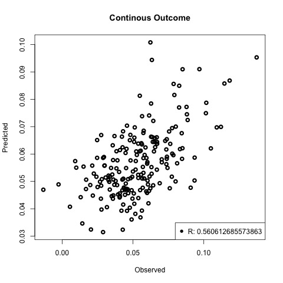
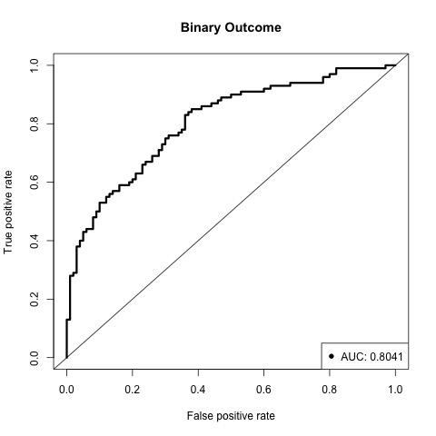

**SICS: A phylogeny-regularized sparse regression model for microbiome-based prediction**
================

`SICS` is a package designed for microbiome-based prediction based on OTU profiles of 16S-rRNA  experiment. 


**1. Introduction**
-------------------
We develop a phylogeny-regularized sparse regression model for “sparse and clustered” microbiome signal. The
proposed method uses a novel phylogeny-based smoothness penalty, which is defined based on the inverse
matrix of the phylogeny-induced correlation matrix. The new phylogeny-based penalty addresses the two
major drawback of the Laplacian-type penalty. It encourages local smoothing, i.e., smoothing effects
from close neighbors, as well as, enjoy the data-driven grouping if the tree is mis-specified.
 
 
 **2. Installation**
---------------

Run following commands in R:

```
library(devtools)
install_github("lichen-lab/SICS")
```

**3. Use SICS**

SICS starts from a OTU abundance matrix (normalized counts), where each row corresponds to a individual and each column corresponds to an OTU, and and a distance matrix among all OTUs. 
Below we will use a simulated data (traing set includes 100 individuals, 200 OTUs; testing set includes 200 individuals, 200 OTUs) to illustrate the workflow of SICS. 
The data is distributed in SICS as `data_SICS`.


**1. Load library and example data**

``` r
library(SICS)
data(data_SICS)
library(ROCR)
help(SICS)
```
**2. Continous outcome: train a model based on the training set, and test the prediction using the testing set**

``` r
set.seed(1234)
beta.sics=SICS(data_gaussian$z,data_gaussian$y,data_gaussian$D,family='gaussian',pho=c(1/4,4),lambda2=c(1/4,4))
yhat=predict(beta.sics,data_gaussian$z.te,family='gaussian')

plot(data_gaussian$y.te, yhat, main='Continous Outcome',xlab='Observed',ylab='Predicted',col=1,lwd=3)
legend("bottomright",legend=paste('R:',cor(data_gaussian$y.te, yhat)),pch=16)
```




**3. Binary outcome: train a model based on the training set, and test the prediction using the testing set**

``` r
set.seed(1234)
beta.sics=SICS(data_binary$z,data_binary$y,data_binary$D,family='binomial',pho=c(1/4,4),lambda2=c(1/4,4))
yhat=predict(beta.sics,data_binary$z.te,family='binomial')

pred=prediction(yhat,data_binary$y.te)
perf=performance(pred,"tpr","fpr")
auc=performance(pred,"auc")@y.values[[1]]
plot(perf,main="Binary Outcome",col=1,lwd=3)
abline(0,1)
legend("bottomright",legend=paste('AUC:',auc),pch=16)
```




**3. Real data example**
------------------------
We first demonstrate two real data examples to compare SICS with other prediction methods. The following packages are
required to be installed before running real data examples.
``` r
install.packages(c('ape','ade4','cluster','randomForest','glmnet','glmgraph','ncvreg'))
install.packages('devtools')
library(devtools)
install_github("lichen-lab/SICS")
install_github("lichen-lab/GMPR")
```
The tutorial for caffeine data analysis (continuous outcome) is https://github.com/lichen-lab/SICS/blob/master/caff.md
The tutorial for smoking data analysis (binary outcome) is https://github.com/lichen-lab/SICS/blob/master/smoking.md


